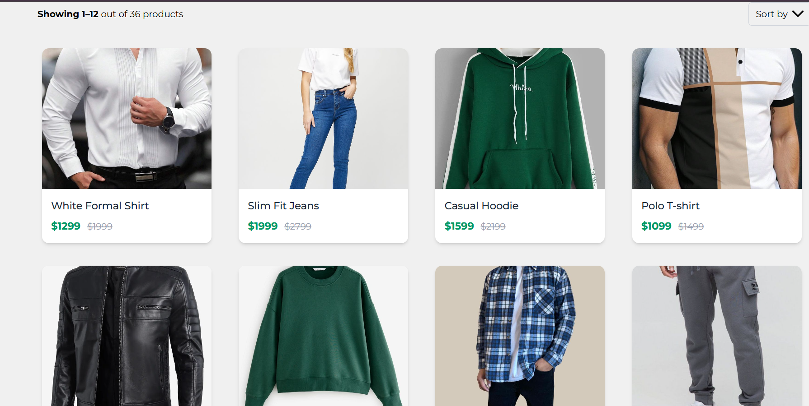
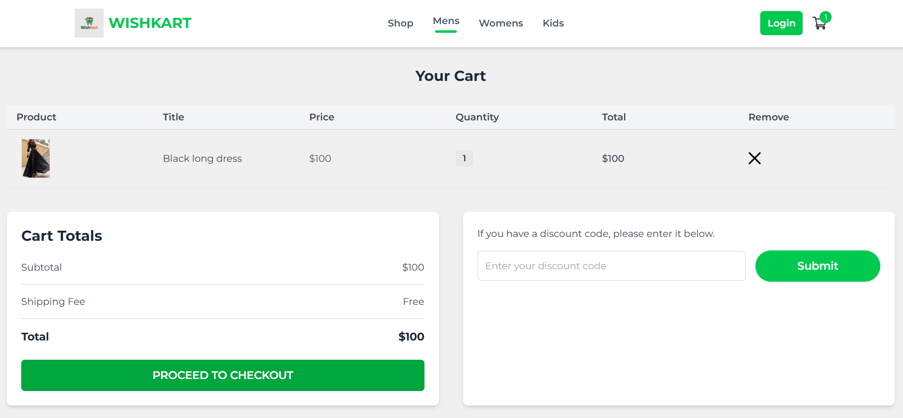
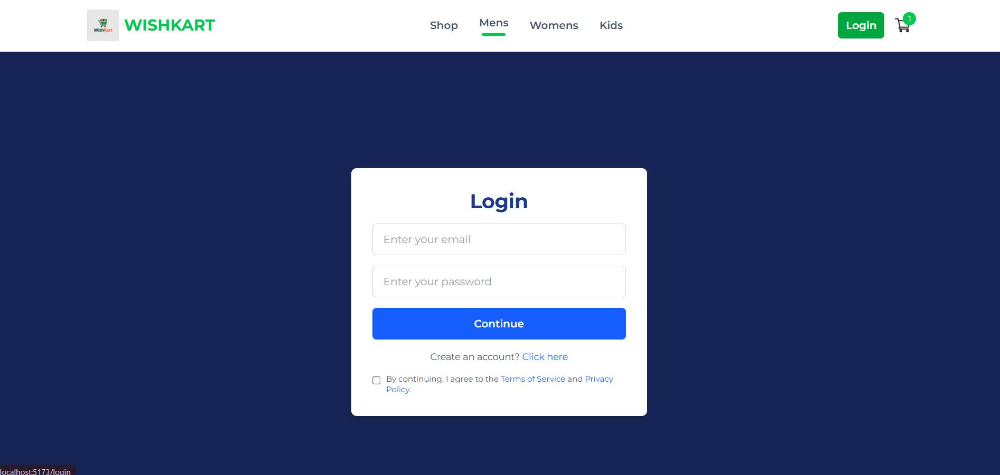
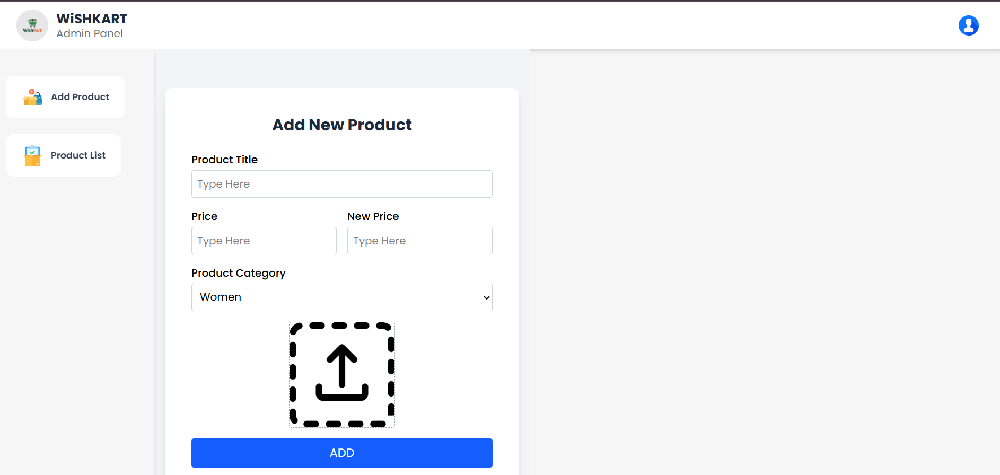

# 🛍️ WishKart - MERN Stack eCommerce Website

WishKart is a full-featured eCommerce web application built using the **MERN stack** (MongoDB, Express.js, React.js, Node.js). It supports product listings, add-to-cart functionality, admin panel, and complete backend integration.

## 📂 Project Structure

WishKart/
├── admin/ # Admin panel (React)
├── frontend/ # Customer-facing frontend (React)
├── backend/ # REST API (Node.js + Express + MongoDB)


---

## 🚀 Features

- 🛒 Add to Cart
- 🧾 Product Listing with Category Filter
- 📦 Product Details Page
- 🛠 Admin Panel (Product Management)
- 📡 Backend REST API
- ⚡ Responsive UI with TailwindCSS (or any framework used)
- 🔐 Secure API with proper folder structure

---

## 🧰 Tech Stack

| Frontend | Backend | Database | Other |
|----------|---------|----------|-------|
| React.js (Vite) | Node.js | MongoDB | Vite |
| Tailwind CSS | Express.js | Mongoose | Postman (for API testing) |
| React Router | JWT/Auth (optional) | | Cloudinary/Multer (optional) |

---





---

## 📦 Installation

### 1. Clone the Repository

```bash
git clone https://github.com/your-username/WishKart.git
cd WishKart

2. Setup Backend
cd backend
npm install
Create .env file in backend/:

env
PORT=5000
MONGODB_URI=your_mongodb_connection_string
Run backend server:

npm start

3. Setup Frontend
cd ../frontend
npm install
npm run dev

4. Setup Admin Panel
cd ../admin
npm install
npm run dev
🌐 Live Demo
Coming soon... or add Vercel / Netlify / Render / Railway deployment links.

📁 Folder Overview
css
Copy
Edit
admin/
  └── src/
frontend/
  └── src/
backend/
  ├── index.js
  ├── routes/
  ├── models/
